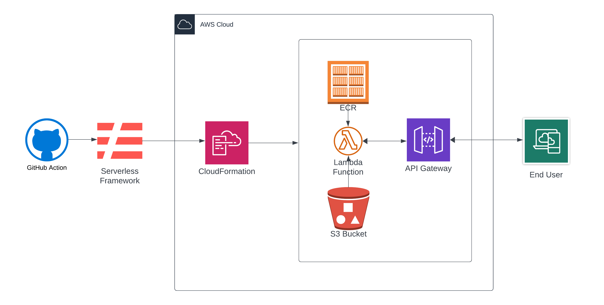

# Deployment Guide for NestJS App on AWS Lambda using Serverless and Docker


This guide details the steps to deploy a NestJS application to AWS Lambda using the Serverless Framework with Docker integration.

## Prerequisites
- AWS account with appropriate permissions
  - Ensure your AWS IAM user has necessary permissions for the services used (Lambda, API Gateway, ECR, IAM).
- Docker installed
- Node.js and npm installed
- Serverless Framework installed globally (`npm install -g serverless`)

## Step 1: Install Necessary Packages

In your NestJS application, install the following npm packages:

```bash
npm install aws-lambda aws-serverless-express
npm install @types/aws-lambda @types/aws-serverless-express --save-dev
```

These packages are necessary for your application to interface correctly with AWS Lambda and API Gateway.

## Step 2: Prepare Your NestJS Application

- Ensure your NestJS application is ready for deployment. It should be tested and working locally.
- Make sure your TS config is setup correctly. You will need these attributes: 
  - "module": "commonjs",
  - "esModuleInterop": true,
  - "target": "es2017" // or es2020

## Step 3: Create a Lambda Handler (lambda.ts)
Before deploying, you need to create a Lambda handler file in your NestJS application. This handler will bootstrap your NestJS app and enable it to communicate with AWS Lambda through the aws-serverless-express library.

Create a new file named lambda.ts in the root of your NestJS project and add the following code:

``` TS
import { Handler, Context } from 'aws-lambda';
import { Server } from 'http';
import { createServer, proxy } from 'aws-serverless-express';
import { eventContext } from 'aws-serverless-express/middleware';

import { NestFactory } from '@nestjs/core';
import { ExpressAdapter } from '@nestjs/platform-express';
import { AppModule } from './app.module';

import express from 'express';

const binaryMimeTypes: string[] = [];

let cachedServer: Server;

async function bootstrapServer(): Promise<Server> {
  if (!cachedServer) {
    const expressApp = express();
    const nestApp = await NestFactory.create(
      AppModule,
      new ExpressAdapter(expressApp),
    );
    nestApp.use(eventContext());
    await nestApp.init();
    cachedServer = createServer(expressApp, undefined, binaryMimeTypes);
  }
  return cachedServer;
}
```

export const handler: Handler = async (event: any, context: Context) => {
  cachedServer = await bootstrapServer();
  return proxy(cachedServer, event, context, 'PROMISE').promise;
};

## Step 4: Create a Dockerfile

Create a `Dockerfile` in the root of your NestJS project with the necessary configurations. Example:

```Dockerfile
FROM --platform=linux/x86_64 public.ecr.aws/lambda/nodejs:18

COPY . .

RUN npm run build

CMD ["dist/lambda.handler"]
```

## Step 5: Configure Serverless
Create a serverless.yml file in your project root with the following configuration:

```yaml
service: nestJS-app

provider:
  name: aws
  region: us-west-1
  profile: myDonut
  stage: prod
  runtime: nodejs18.x
  stackName: my-delicious-donut-stack
  ecr:
    images:
      nestJS_app_image:
        # uri: ecr uri
        path: ./
package:
  excludeDevDependencies: true
  individually: true
  exclude:
    - __tests__/**
    - .gitignore
    - package-lock.json
    - .git/**
functions:
  hello:
    image:
      name: nestJS_app_image
      command:
          - dist/lambda.handler
      entryPoint:
        - '/lambda-entrypoint.sh'
      # timeout: 25
      # memorySize: 512
    events:
      - http:
          method: any
          path: /{any+}

```

When setting up your `serverless.yml` file, it's essential to understand its various components and how they contribute to the deployment of your NestJS application on AWS Lambda. Here are key aspects of your configuration:
### Service

- `service: nestJS-app`: Defines the name of your Serverless service. This name is used to group all the components of your application in AWS.

### Provider

- `provider`: Specifies the cloud provider (`aws` in this case) and additional configurations.
  - `region`: Defines the AWS region where your services will be deployed (e.g. `us-west-1`).
  - `profile`: Refers to the AWS CLI profile to use for deployment (e.g. `myDonut`).
  - `stage`: The stage of your service (e.g.`prod`). Stages are useful for maintaining different versions of your application, like development, staging, and production.
  - `runtime`: Specifies the runtime environment for your Lambda function (e.g. `nodejs18.x`).
  - `stackName`: Custom name for the CloudFormation stack (e.g. `my-delicious-donut-stack`).

### ECR

- `ecr`: Configuration for Docker images.
  - `images`: Defines Docker images used by your functions.
    - `nestJS_app_image`: Name of the Docker image. 
    - `path`: The path to your Docker context (current directory `./` in this case). The Dockerfile should be located in this directory.

### Package

- `package`: Controls how the Serverless Framework packages your service.
  - `excludeDevDependencies`: Excludes development dependencies from the package to reduce size.
  - `individually`: Packages each function separately for faster deployment.
  - `exclude`: Specific files or directories to exclude from the deployment package.

### Functions

- `functions`: Defines the functions in your service.
  - `hello`: Name of your function.
    - `image`: Configuration for the Docker image.
      - `name`: References the Docker image defined under `ecr`.
      - `command`: Overrides the default `CMD` in Docker (`dist/lambda.handler` in this case, pointing to your Lambda handler).
      - `entryPoint`: Overrides the default entry point (`/lambda-entrypoint.sh`).
    - `events`: Triggers for your function.
      - `http`: HTTP event configuration, making your function accessible via HTTP.
        - `method`: The HTTP method (any in this case).
        - `path`: The request path (`/{any+}` is a wildcard path matching any request).

### Additional considerations

- Remember to replace placeholders like `myDonut` with your actual AWS profile name and `us-west-1` with your preferred AWS region.
- Commented-out configurations like `timeout` and `memorySize` can be used to customize the behavior of your Lambda function.
- The `serverless.yml` file is central to defining how your service will be deployed and managed by the Serverless Framework on AWS.


## Step 6: Deploy with Serverless

Run the following command to deploy your application to AWS Lambda:

```bash
serverless deploy
```

This command triggers several actions in the background to set up your application in the AWS environment:

- **Docker Image Creation and Upload**: The Serverless Framework builds a Docker image from your NestJS application and pushes it to an AWS Elastic Container Registry (ECR) repository.
- **CloudFormation Stack**: Serverless uses AWS CloudFormation to manage the infrastructure resources. It creates a new CloudFormation stack that defines and configures these resources.
- **Lambda Function**: An AWS Lambda function is created using the Docker image from ECR. This function will serve your NestJS application.
- **API Gateway**: An Amazon API Gateway is set up to provide an HTTP endpoint for your Lambda function, allowing your application to handle HTTP requests.
- **S3 Bucket**: If your Serverless configuration or your application requires, an Amazon S3 bucket will be created. This bucket can be used for various purposes, such as hosting deployment artifacts, static website content, or file storage.

## Step 7: Verify Deployment

- Check the AWS Lambda and API Gateway consoles to ensure your app is deployed.
- Use the provided endpoint URL to test your application.

## Additional Information

- Modify the Dockerfile and serverless.yml as needed to suit your project's requirements.
- Remember to include any environment variables or additional configurations required by your application.

## Deployment Automation
Leverage the power of CI/CD by setting up an automated deployment pipeline with GitHub Actions or a tool of your choice. This will streamline your deployment process, ensuring consistent and reliable delivery of your latest builds to AWS Lambda.
